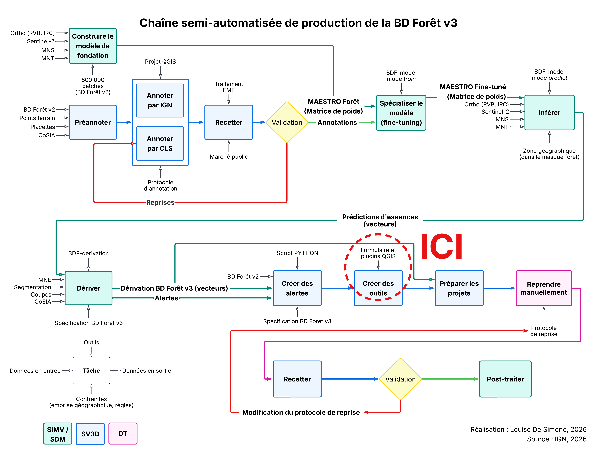

# *Reprise PI*

Plugin QGIS d'outils de reprise en photo-interprétation pour la BD Forêt v3.

## Sommaire

- [À quoi sert ce plugin ?](#à-quoi-sert-ce-plugin-)
- [À quoi ne sert pas ce plugin ?](#à-quoi-ne-sert-pas-ce-plugin-)
- [Prérequis](#prérequis)
- [Installation](#installation)
- [Les outils](#les-outils)
- [Couches d'entrée](#couches-dentrée)
  - [Champs de la couche de travail (`Bdfv3 Priorites`)](#champs-de-la-couche-de-travail-bdfv3-priorites)
  - [Champs de la couche `BDFv2`](#champs-de-la-couche-bdfv2)
  - [Champs de la couche d'alertes (`Alertes Centroides`)](#champs-de-la-couche-dalertes-alertes-centroides)
  - [Champs de la couche `Alertes Enveloppes`](#champs-de-la-couche-alertes-enveloppes)
  - [Relation QGIS entre `Alertes Centroides` et `Bdfv3 Priorites`](#relation-qgis-entre-alertes-centroides-et-bdfv3-priorites)
- [Documentation](#documentation)
- [Auteur](#auteur)

## À quoi sert ce plugin ?

*Reprise PI* est un outil métier conçu et testé pour la phase de reprise manuelle de la chaîne de
production de la BD Forêt v3. Cette étape intervient après l'inférence et la dérivation, qui
produisent une première version automatique de la BD Forêt v3, et avant les post-traitements
finaux.

Le plugin permet aux photo-interprètes de contrôler les secteurs signalés par des alertes et,
lorsque cela est nécessaire, de corriger directement la donnée dans QGIS en remodelant, séparant,
fusionnant ou renseignant les polygones. Il intègre également des contrôles destinés à sécuriser
l'édition.

## À quoi ne sert pas ce plugin ?

Le plugin agit uniquement sur des données de travail intégrées à la chaîne de production. Il n’intervient pas sur les données déjà validées et diffusées dans les référentiels officiels de l’IGN.

## Prérequis

- QGIS ≥ 3.44.
- Un projet QGIS contenant les 5 couches suivantes, chargées avec leur nom standard. Le plugin
  reste techniquement fonctionnel avec seulement la première (les autres se contentent d'être
  inactives, et la dernière n'est jamais lue par le plugin), mais **pour un chantier, les 5 sont
  obligatoires** :
  - `Bdfv3 Priorites` (couche de travail à reprendre) ;
  - `Bdfv3 Emprise` (emprise de production) ;
  - `BDFv2` (source pour l'outil « Reporter depuis BDFv2 ») ;
  - `Alertes Centroides` (points d'alerte liés à la couche de travail) ;
  - `Alertes Enveloppes` (visualisation de l'emprise spatiale des alertes, contexte pour le PI,
    jamais lue par le plugin lui-même).
- Une relation QGIS préconfigurée entre `Alertes Centroides` et `Bdfv3 Priorites`.

## Installation

1. Copier le dossier `reprise_pi` dans le répertoire des plugins QGIS du profil utilisateur
   (`~/AppData/Roaming/QGIS/QGIS3/profiles/default/python/plugins/` sous Windows).
2. Dans QGIS : *Extensions → Gérer et installer les extensions*, activer *Reprise PI*.
3. La barre d'outils *Reprise PI* apparait.

## Les outils

| Icône | Outil | Rôle |
|---|---|---|
|  | Créer un nouveau polygone BD Forêt | Dessine une nouvelle entité, retire sa surface aux polygones existants qu'elle recouvre. |
|  | Séparer un ou plusieurs polygones de la BD Forêt | Découpe un ou plusieurs polygones le long d'une ligne tracée. |
|  | Fusionner plusieurs polygones BD Forêt | Fusionne plusieurs polygones sélectionnés en une seule entité. |
|  | Remodeler la limite entre 2 polygones BD Forêt | Redessine une frontière partagée entre deux polygones. |
|  | Reporter un polygone depuis BDFv2 | Colle un polygone de la BD Forêt v2 dans la couche de travail v3. |
|  | Vérification BD Forêt | Ouvre le panneau de nettoyage automatique et de recherche des anomalies. |
|  | Fiche précédente *(table attributaire)* | Revient à la fiche précédemment ouverte. |
|  | Fiche suivante *(table attributaire)* | Revient à la fiche suivante de l'historique. |
|  | Vérifier les alertes et recalculer *(table attributaire)* | Recalcule le classement et les indicateurs d'alertes sur toute la couche. |

## Couches d'entrée

Chaque couche utilisée par le plugin est retrouvée dans le projet par mot-clé dans son nom
(normalisé : minuscules, sans accents), jamais par un chemin ou un identifiant fixe. La casse et
les accents n'ont donc pas d'importance. Le type de fournisseur de données (GeoPackage,
PostGIS...) n'est jamais vérifié dans le code : GeoPackage est la convention du chantier, pas
une contrainte technique du plugin.

| Nom dans le chantier | Couche | Style | Règle | Fonction |
|---|---|---|---|---|
| Bdfv3 Priorites | bdfv3_priorites.gpkg | bdfv3_priorites.qml | Nom commençant par `Bdfv3 Priorites`. | `trouver_couche_travail()` (commun_couches.py) |
| Bdfv3 Emprise | bdfv3_emprise.gpkg | bdfv3_emprise.qml | Polygonale, nom contenant `emprise`. | `trouver_couche_emprise()` (commun_couches.py) |
| Bdfv2 | bdfv2.gpkg | bdfv2.qml | Polygonale, nom contenant `bdfv2`. | `_trouver_couche_bdfv2()` (edition_reporter_bdfv2.py) |
| Alertes Centroides | alertes_centroides.gpkg | alertes_centroides.qml | Nom commençant par `Alertes Centroides`. | `trouver_couche_alertes()` (commun_couches.py) |
| Alertes Enveloppes | alertes_enveloppes.gpkg | alertes_enveloppes.qml | | |

### Champs de la couche de travail (`Bdfv3 Priorites`)

| Champ | Type | Plugin Reprise PI | Rôle dans le plugin | Formulaire (.qml) | Symbologie (.qml) | Étiquette (.qml) |
|---|---|---|---|---|---|---|
| `fid` | entier | ✓ | Identifiant natif du GeoPackage, clé technique. | ✗ | ✗ | ✗ |
| `id_foret` | entier | ✓ | Identifiant de travail, pas définitif. | ✓ | ✗ | ✗ |
| `classement` | entier | ✓ | Rang 1..N recalculé par « Vérifier les alertes et recalculer ». | ✗ | ✗ | ✗ |
| `surface` | numérique | ✓ | Recalculée automatiquement à chaque modification géométrique. | ✓ | ✗ | ✗ |
| `millesime` | entier | ✓ | Recopié tel quel lors d'une création/séparation. | ✓ | ✗ | ✗ |
| `nouvelle_essence` | texte | ✓ | Essence retouchée par le PI, comparée à `libelle_essence`. | ✓ | ✗ | ✓ |
| `libelle_essence` | texte | ✓ | Essence d'origine, avant reprise. | ✓ | ✗ | ✓ |
| `code_tff` | texte | ✓ | Comparé entre voisins pour la règle « polygones adjacents identiques ». | ✓ | ✗ | ✓ |
| `dominante_feuillu` | booléen | ✓ | Réservé aux essences mixtes (nommé `dominante_feuillus` dans ce chantier). | ✓ | ✗ | ✗ |
| `dominante_conifere` | booléen | ✓ | Réservé aux essences mixtes (nommé `dominante_coniferes` dans ce chantier). | ✓ | ✗ | ✗ |
| `crjp` | booléen | ✓ | Exclusif avec `lande`/`non_foret` (nommé `CRJP` dans ce chantier). | ✓ | ✗ | ✗ |
| `ouvert` | booléen | ✓ | Exclusif avec `ferme`. | ✓ | ✗ | ✗ |
| `ferme` | booléen | ✓ | Exclusif avec `ouvert`. | ✓ | ✗ | ✗ |
| `non_foret` | booléen | ✓ | Exclusif avec `crjp`/`lande`. | ✓ | ✗ | ✗ |
| `lande` | booléen | ✓ | Exclusif avec `crjp`/`non_foret`. | ✓ | ✗ | ✗ |
| `nb_alertes` | entier | ✓ | Champ dérivé, recalculé depuis les alertes liées. | ✗ | ✗ | ✗ |
| `nb_alertes_vues` | entier | ✓ | Champ dérivé, recalculé depuis les alertes liées. | ✗ | ✗ | ✗ |
| `priorite_max` | numérique | ✓ | Champ dérivé, recalculé depuis les alertes liées. | ✗ | ✗ | ✗ |
| `essence_v2_priorite_max` | texte | ✓ | Champ dérivé, recalculé depuis les alertes liées. | ✗ | ✗ | ✗ |
| `toutes_alertes_vues` | booléen | ✓ | Champ dérivé, sauf sans aucune alerte liée : reste alors une validation manuelle. | ✓ | ✗ | ✗ |
| `libelle_tff` | texte | ✗ | | ✓ | ✗ | ✗ |
| `code_essence` | texte | ✗ | | ✓ | ✗ | ✗ |
| `densite_couvert_arbore` | entier | ✗ | | ✓ | ✗ | ✗ |
| `hauteur_vegetation_moyenne` | numérique | ✗ | | ✓ | ✗ | ✗ |
| `hauteur_vegetation_ecart_type` | numérique | ✗ | | ✓ | ✗ | ✗ |

### Champs de la couche `BDFv2`

| Champ | Type | Plugin Reprise PI | Rôle dans le plugin | Formulaire (.qml) | Symbologie (.qml) | Étiquette (.qml) |
|---|---|---|---|---|---|---|
| `TFV_G11` | texte | ✗ | | ✓ | ✗ | ✓ |

### Champs de la couche d'alertes (`Alertes Centroides`)

| Champ | Type | Plugin Reprise PI | Rôle dans le plugin | Formulaire (.qml) | Symbologie (.qml) | Étiquette (.qml) |
|---|---|---|---|---|---|---|
| `id_foret` | entier | ✓ | Clé de liaison avec `Bdfv3 Priorites` (voir relation ci-dessous). | ✓ | ✗ | ✗ |
| `vu` | booléen | ✓ | Source de vérité pour `nb_alertes_vues`/`toutes_alertes_vues` côté parent. | ✓ | ✓ | ✗ |
| `priorite` | entier | ✓ | Alimente `priorite_max` côté parent. | ✓ | ✓ | ✗ |
| `ESSENCE_V2` | texte | ✓ | Alimente `essence_v2_priorite_max` côté parent. | ✓ | ✗ | ✗ |
| `source_alerte` | texte | ✗ | | ✓ | ✓ | ✗ |
| `niveau_alerte` | texte | ✗ | | ✓ | ✗ | ✗ |
| `millesime_V2` | texte | ✗ | | ✓ | ✗ | ✗ |
| `CODE_TFV_V2` | texte | ✗ | | ✓ | ✗ | ✗ |
| `TFV_G11_V2` | texte | ✗ | | ✓ | ✗ | ✗ |
| `TFV_V2` | texte | ✗ | | ✓ | ✗ | ✗ |
| `cosia_derivation` | texte | ✗ | | ✓ | ✗ | ✗ |
| `essence_prediction` | texte | ✗ | | ✓ | ✗ | ✗ |

### Champs de la couche `Alertes Enveloppes`

| Champ | Type | Plugin Reprise PI | Rôle dans le plugin | Formulaire (.qml) | Symbologie (.qml) | Étiquette (.qml) |
|---|---|---|---|---|---|---|
| `priorite` | entier | ✗ | | ✓ | ✓ | ✗ |

### Relation QGIS entre `Alertes Centroides` et `Bdfv3 Priorites`

Le plugin ne crée jamais de relation lui-même : il en cherche une déjà existante dans le projet
(Propriétés du projet → Relations), avec exactement :

- couche référençante (l'« enfant ») : `Alertes Centroides` ;
- couche référencée (le « parent ») : `Bdfv3 Priorites` ;
- paire de champs : `id_foret` (enfant) vers `id_foret` (parent).

Le nom donné à la relation n'a aucune importance, seuls les deux couches et la paire de champs
sont vérifiés. Sans cette relation, les compteurs d'alertes et le classement restent inactifs.

## Documentation

- [GUIDE_UTILISATION.md](GUIDE_UTILISATION.md) : mode d'emploi pour l'utilisateur du plugin
  (photo-interprète) : que fait chaque outil, comment s'en servir, comment corriger une anomalie.
- [README_CODE.md](README_CODE.md) : guide de lecture du code pour un développeur qui reprend
  le plugin : organisation des fichiers, règles d'architecture, contexte GPKG/identifiants de
  travail.
- [DOCUMENTATION_CODE.md](DOCUMENTATION_CODE.md) : référence technique générée depuis le code,
  chaque fichier, classe et fonction avec sa signature et son numéro de ligne.

## Auteur

Louise De Simone, IGN.
